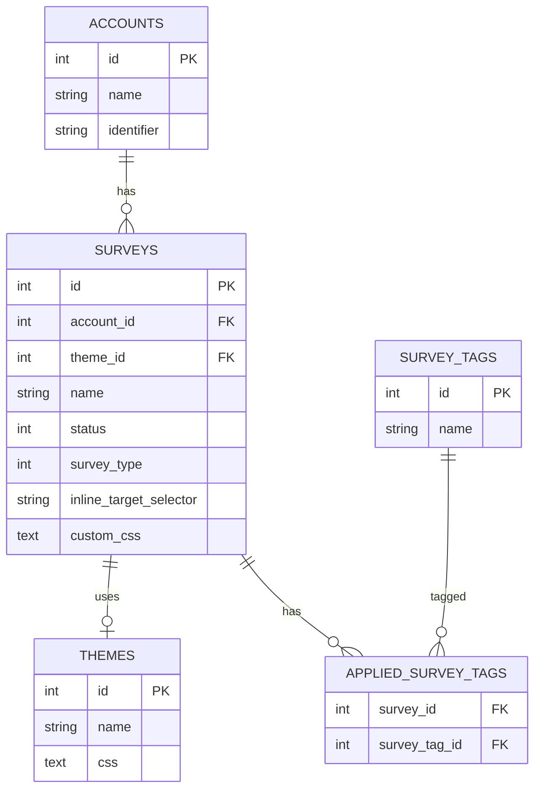
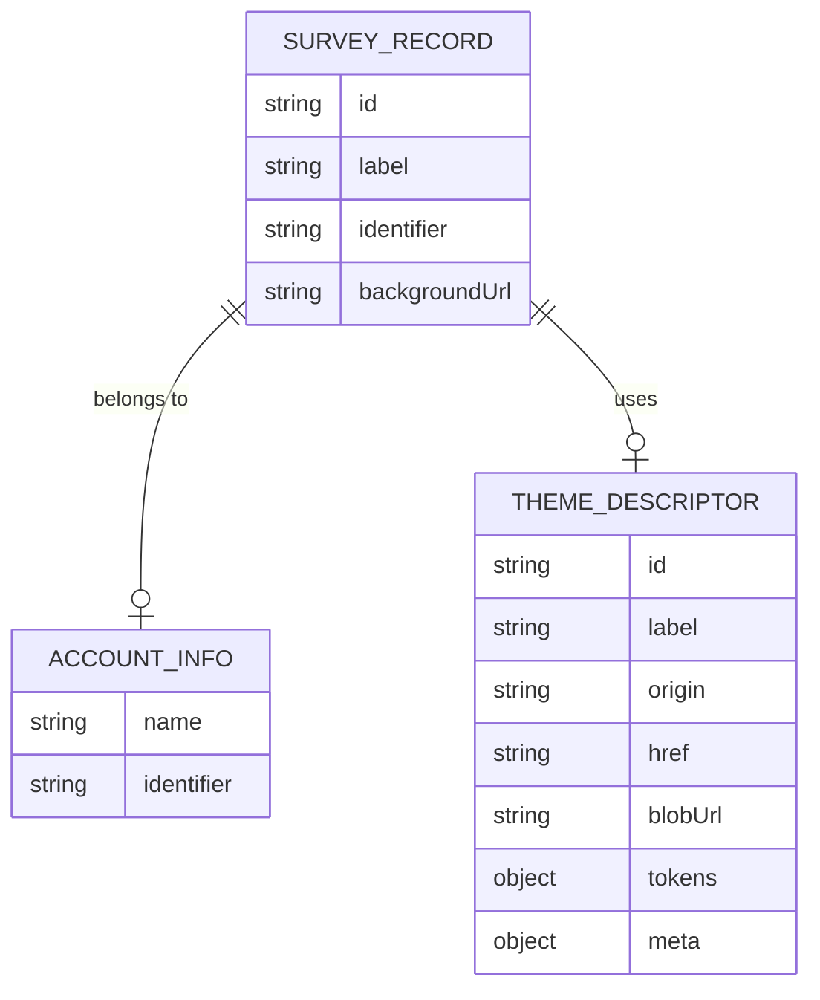
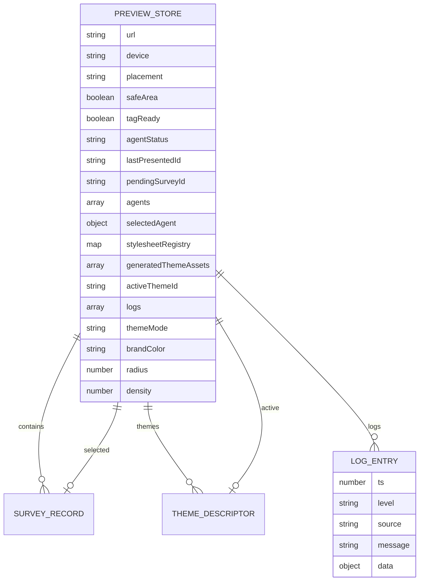
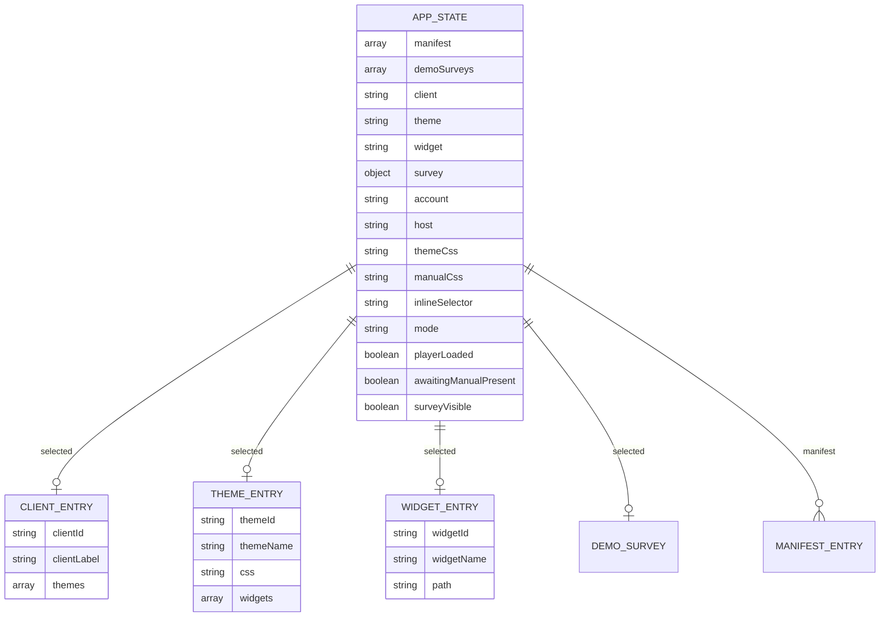
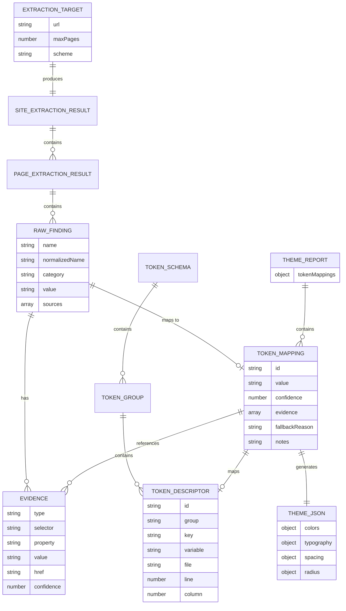
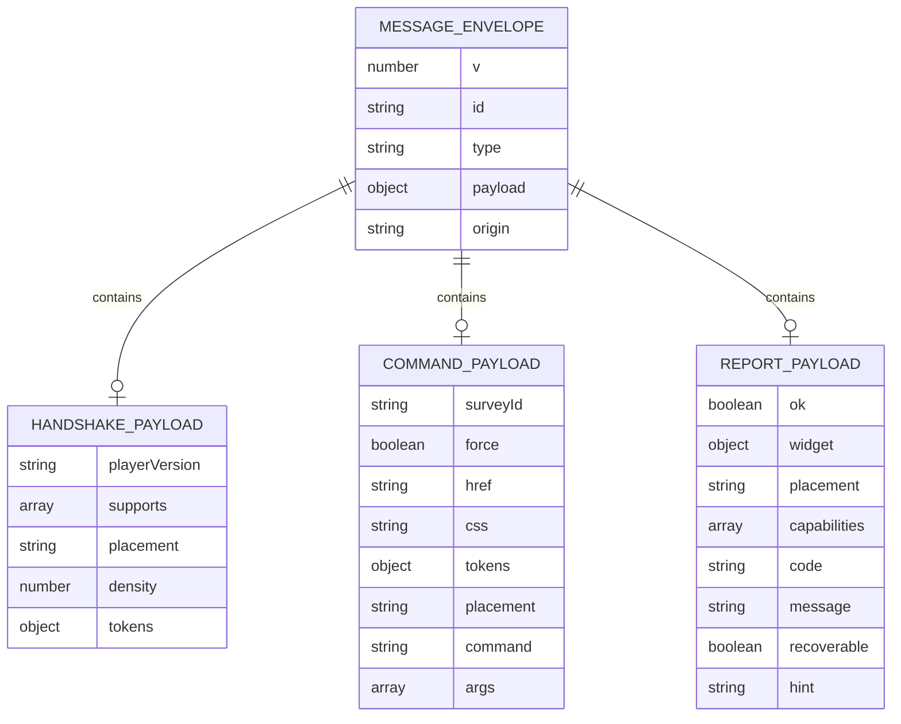

# Pulse Widgets Data Model

**Last Updated:** 2025-02-15  
**Scope:** Database schemas, service models, and UI data structures

This document provides Entity Relationship Diagrams (ERDs) for all data models used in the Pulse Widgets application, including database schemas, service models, and UI data structures.

---

## Table of Contents

1. [Database Schema](#database-schema)
2. [Service Models](#service-models)
3. [UI Data Models](#ui-data-models)
4. [Theme Generator Models](#theme-generator-models)
5. [Protocol Message Models](#protocol-message-models)

---

## Database Schema

The database schema is inferred from SQL queries and demo data structures. The primary entities are:

### Entity Relationship Diagram

See `docs/mermaid/data-model-database.mermaid` for the complete diagram.



### Database Entities

#### Accounts
- **id** (int, PK): Unique account identifier
- **name** (string): Account display name
- **identifier** (string): Pulse Insights identifier (e.g., "PI-81598442")

#### Surveys
- **id** (int, PK): Unique survey identifier
- **account_id** (int, FK): Reference to Accounts
- **theme_id** (int, FK): Reference to Themes
- **name** (string): Survey display name
- **status** (int): Survey status (0=Draft, 1=Live, 2=Paused, 3=Complete, 4=Archived)
- **survey_type** (int): Type (0=Docked Widget, 1=Inline, 2=Top Bar, 3=Bottom Bar, 4=Fullscreen)
- **inline_target_selector** (string): CSS selector for inline placement
- **custom_css** (text): Custom CSS for survey styling

#### Themes
- **id** (int, PK): Unique theme identifier
- **name** (string): Theme display name
- **css** (text): Theme CSS content

#### Survey Tags
- **id** (int, PK): Unique tag identifier
- **name** (string): Tag name (e.g., "Agent")

#### Applied Survey Tags
- **survey_id** (int, FK): Reference to Surveys
- **survey_tag_id** (int, FK): Reference to Survey Tags

---

## Service Models

Service models represent data structures used in application services and APIs.

### Survey Service Models

See `docs/mermaid/data-model-services.mermaid` for the complete diagram.



#### SurveyRecord
```typescript
interface SurveyRecord {
  id: string;                    // Survey ID
  label: string;                  // Display label (e.g., "Survey Name — Account")
  identifier?: string;           // Pulse Insights identifier
  backgroundUrl?: string;        // Preview background URL
}
```

#### ThemeDescriptor
```typescript
interface ThemeDescriptor {
  id: string;                    // Theme ID
  label: string;                 // Display label
  origin: 'example' | 'generated' | 'manual';
  href?: string;                 // Curated theme CSS link
  blobUrl?: string;              // Generated CSS blob URL
  tokens?: {                     // Design tokens
    brand?: string;
    radius?: number;
    density?: -1 | 0 | 1;
  };
  meta?: {                       // Metadata
    industry?: string;
    variant?: string;
    clientId?: string;
    widgets?: string[];
  };
}
```

### Demo Survey Model

```typescript
interface DemoSurvey {
  accountName: string;
  surveyName: string;
  identifier: string;
  surveyId: number;
  accountId: number;
  surveyStatus: string;
  surveyStatusName: string;
  surveyType: string;
  surveyTypeName: string;
  inlineTargetSelector: string;
  surveyCss: string;
  themeId: string;
  theme: string;
  themeCss: string;
}
```

---

## UI Data Models

UI data models represent the application state and component data structures.

### Preview Application State

See `docs/mermaid/data-model-ui.mermaid` for the complete diagram.



#### Preview Store (v3.js)
```typescript
interface PreviewStore {
  // Preview context
  url: string;                    // Preview URL
  device: 'Desktop' | 'Tablet' | 'Mobile';
  placement: 'BR' | 'BL' | 'TR' | 'TL';
  safeArea: boolean;
  
  // Tag/Agent state
  tagReady: boolean;
  agentStatus: 'Idle' | 'Presenting';
  lastPresentedId?: string;
  pendingSurveyId?: string;
  
  // Survey data
  agents: SurveyRecord[];
  selectedAgent?: SurveyRecord;
  
  // Theme data
  stylesheetRegistry: Map<string, ThemeDescriptor>;
  generatedThemeAssets: string[];
  activeThemeId?: string;
  
  // UI state
  logs: LogEntry[];
  themeMode: 'dark' | 'light' | 'auto';
  brandColor: string;
  radius: number;
  density: -1 | 0 | 1;           // -1=compact, 0=comfortable, 1=cozy
}
```

#### LogEntry
```typescript
interface LogEntry {
  ts: number;                     // Timestamp (Date.now())
  level: 'info' | 'warn' | 'error' | 'event';
  source: 'ui' | 'tag' | 'trigger' | 'theme' | 'net';
  message: string;
  data?: Record<string, unknown>;
}
```

### Main Application State (preview/app/main.js)



#### Application State
```typescript
interface AppState {
  manifest: ManifestEntry[];
  demoSurveys: DemoSurvey[];
  client: string | null;
  theme: string | null;
  widget: string | null;
  survey: DemoSurvey | null;
  account: string;
  host: string;
  themeCss: string | null;
  manualCss: string | null;
  inlineSelector: string | null;
  mode: 'overlay' | 'inline';
  playerLoaded: boolean;
  awaitingManualPresent: boolean;
  surveyVisible: boolean;
}
```

#### Manifest Entry
```typescript
interface ManifestEntry {
  clientId: string;
  clientLabel: string;
  themes: ThemeManifestEntry[];
}

interface ThemeManifestEntry {
  themeId: string;
  themeName: string;
  css: string;
  widgets?: WidgetManifestEntry[];
}

interface WidgetManifestEntry {
  widgetId: string;
  widgetName: string;
  path: string;
}
```

---

## Theme Generator Models

Theme generator models represent data structures used in theme generation and extraction.

### Theme Generator Data Flow

See `docs/mermaid/data-model-theme-generator.mermaid` for the complete diagram.



### Core Types

#### RawFinding
```typescript
interface RawFinding {
  name: string;                   // Original name
  normalizedName: string;         // Normalized name
  category: 'color' | 'font' | 'spacing' | 'radius' | 'shadow' | 'z-index' | 'unknown';
  value: string;                  // Extracted value
  sources: Evidence[];            // Evidence sources
}
```

#### Evidence Types
```typescript
type Evidence = 
  | CssVarEvidence 
  | CssPropertyEvidence 
  | ComputedEvidence 
  | LogoEvidence 
  | DerivedEvidence;

interface CssVarEvidence {
  type: 'css-var';
  selector: string;
  property: string;               // CSS variable name (e.g., "--color-primary")
  value: string;
  href: string | null;
  important?: boolean;
}

interface CssPropertyEvidence {
  type: 'css-prop';
  selector: string;
  property: string;                // CSS property name
  value: string;
  href: string | null;
  important?: boolean;
}

interface ComputedEvidence {
  type: 'computed';
  selector: string;
  property: string;
  value: string;                  // Computed value
}

interface LogoEvidence {
  type: 'logo';
  source: string;
  method: 'image' | 'svg';
  value: string;                  // Color value extracted from logo
  note?: string;
}

interface DerivedEvidence {
  type: 'derived';
  note: string;                    // Explanation of derivation
}
```

#### TokenMapping
```typescript
interface TokenMapping {
  id: string;                     // Token ID (e.g., "colors.primary")
  value: string;                   // Mapped value
  confidence: number;              // Confidence score (0-1)
  evidence: Evidence[];            // Supporting evidence
  fallbackReason?: string | null; // Reason for fallback
  notes?: string | null;          // Additional notes
}
```

#### TokenSchema
```typescript
interface TokenSchema {
  groups: TokenGroup[];
  variables: Record<string, SassVariable>;
  builders: BuilderReference[];
  tokenIndex: Record<string, TokenDescriptor>;
}

interface TokenGroup {
  name: string;                   // Normalized group name
  originalName: string;           // Original group name
  file: string;                   // Source file path
  line: number;
  column: number;
  tokens: TokenDescriptor[];
}

interface TokenDescriptor {
  id: string;                      // Token ID
  group: string;                   // Group name
  originalGroup: string;
  key: string;                     // Token key
  originalKey: string;
  variable: string | null;         // Sass variable name
  file: string;                    // Source file
  line: number;
  column: number;
}
```

#### ThemeJson
```typescript
interface ThemeJson {
  [group: string]: Record<string, unknown>;
  // Example structure:
  // {
  //   colors: {
  //     primary: "#2563eb",
  //     text: "#1f2937",
  //     ...
  //   },
  //   typography: {
  //     fontFamily: "system-ui, sans-serif",
  //     ...
  //   }
  // }
}
```

#### ThemeReport
```typescript
interface ThemeReport {
  [tokenId: string]: TokenMapping;
  // Example:
  // {
  //   "colors.primary": {
  //     id: "colors.primary",
  //     value: "#2563eb",
  //     confidence: 0.95,
  //     evidence: [...]
  //   },
  //   ...
  // }
}
```

#### Extraction Results
```typescript
interface ExtractionTarget {
  url: string;
  maxPages?: number;
  scheme?: 'light' | 'dark';
}

interface BrowserCollectorResult {
  declarations: CollectedDeclaration[];
  computed: ComputedSample[];
  logoColors: LogoColorSample[];
  errors: string[];
}

interface PageExtractionResult extends BrowserCollectorResult {
  url: string;
  title: string;
}

interface SiteExtractionResult {
  pages: PageExtractionResult[];
  errors: string[];
}
```

---

## Protocol Message Models

Protocol message models represent the communication contract between Bridge and Player components.

### Protocol v1 Message Structure

See `docs/mermaid/data-model-protocol.mermaid` for the complete diagram.



### Message Envelope
```typescript
interface MessageEnvelope {
  v: number;                       // Protocol version (1)
  id: string;                     // Correlation ID
  type: MessageType;
  payload: MessagePayload;
  origin?: 'bridge' | 'player';   // Optional, for logging
}

type MessageType = 
  | 'hello' | 'init' | 'ready'     // Handshake
  | 'present' | 'dismiss' | 'applyTheme' | 'trigger' | 'setPlacement' | 'setTokens' | 'ping'  // Commands
  | 'status' | 'error' | 'pong';   // Reports
```

### Handshake Payloads
```typescript
// Player → Bridge
interface HelloPayload {
  playerVersion: string;
  supports: string[];
}

// Bridge → Player
interface InitPayload {
  placement?: 'BR' | 'BL' | 'TR' | 'TL';
  density?: -1 | 0 | 1;
  tokens?: {
    brand?: string;
    radius?: number;
    density?: -1 | 0 | 1;
  };
}
```

### Command Payloads
```typescript
interface PresentPayload {
  surveyId: string;
  force?: boolean;
}

interface ApplyThemePayload {
  href?: string;
  css?: string;
  tokens?: {
    brand?: string;
    radius?: number;
    density?: -1 | 0 | 1;
  };
}

interface TriggerPayload {
  command: string;
  args?: any[];
}

interface SetPlacementPayload {
  placement: 'BR' | 'BL' | 'TR' | 'TL';
}

interface SetTokensPayload {
  brand?: string;
  radius?: number;
  density?: -1 | 0 | 1;
}
```

### Report Payloads
```typescript
interface StatusPayload {
  ok: true;
  widget?: {
    visible: boolean;
    bounds?: {
      x: number;
      y: number;
      w: number;
      h: number;
    };
  };
  placement?: string;
  capabilities?: string[];
}

interface ErrorPayload {
  code: string;
  message?: string;
  recoverable?: boolean;
  hint?: string;
}
```

---

## Relationships Summary

### Database Relationships
- **Accounts** → **Surveys** (1:N)
- **Surveys** → **Themes** (N:1)
- **Surveys** → **Survey Tags** (N:M via AppliedSurveyTags)

### Service Relationships
- **SurveyRecord** → **ThemeDescriptor** (N:1, optional)
- **PreviewStore** → **SurveyRecord** (1:N)
- **PreviewStore** → **ThemeDescriptor** (1:N via stylesheetRegistry)

### Theme Generator Relationships
- **ExtractionTarget** → **RawFinding** (1:N)
- **RawFinding** → **TokenMapping** (N:1)
- **TokenMapping** → **ThemeJson** (N:1)
- **TokenSchema** → **TokenDescriptor** (1:N)

### Protocol Relationships
- **MessageEnvelope** → **Payload** (1:1, polymorphic)

---

## Notes

1. **Database Schema**: The database schema is inferred from SQL queries. Actual implementation may vary.

2. **Service Models**: Service models are TypeScript interfaces used in JavaScript/CommonJS codebases. They represent runtime data structures.

3. **UI Data Models**: UI data models represent application state and are managed through reactive stores (EventTarget-based).

4. **Theme Generator Models**: Theme generator models follow a pipeline: Extraction → Analysis → Mapping → Generation.

5. **Protocol Models**: Protocol models enforce strict typing for inter-component communication via `window.postMessage`.

---

## References

- Database Schema: `preview/data/pulse-agents-demo.sql`
- Service Models: `preview/v3-prototype/services/`
- UI Models: `preview/v3-prototype/v3.js`, `preview/app/main.js`
- Theme Generator: `theme-generator/v2/src/types.ts`
- Protocol: `docs/protocols/protocol-v1.md`

