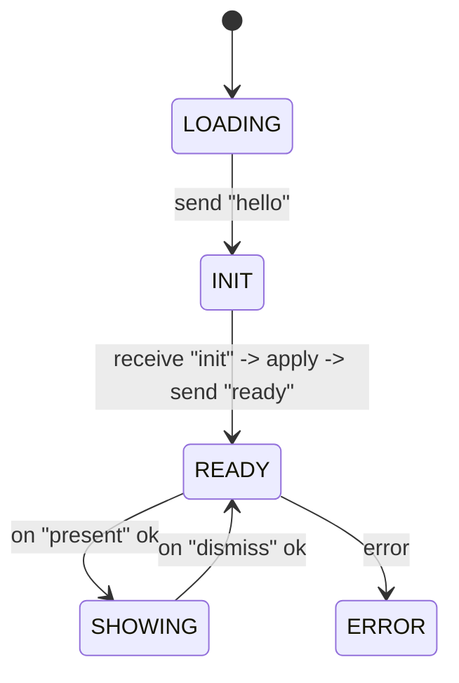
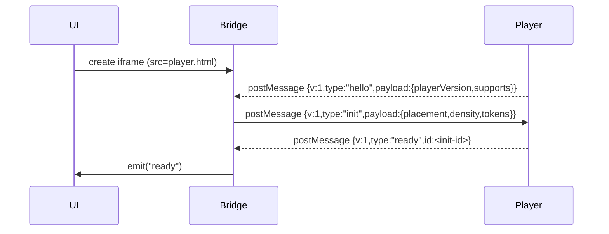
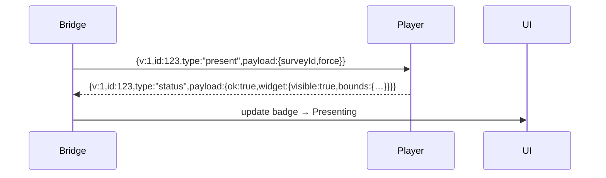
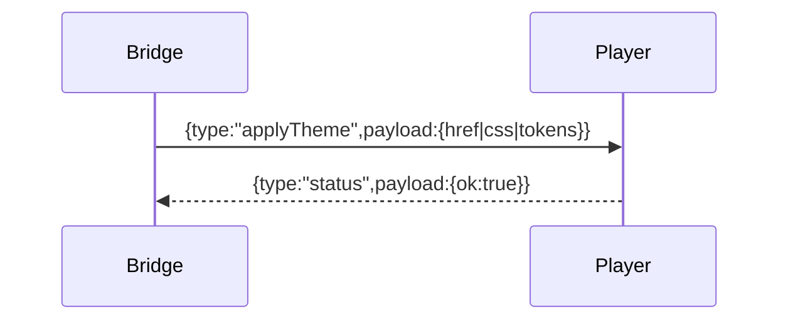
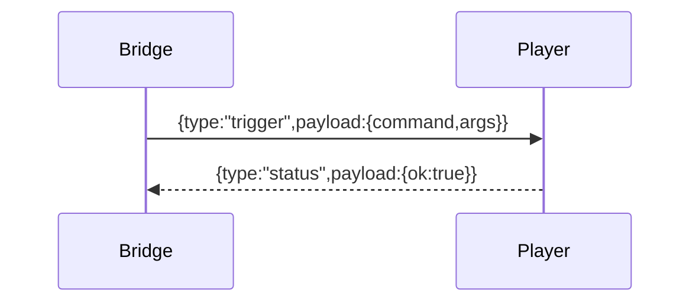

# ARCH-PROTOCOL‑v1
**Bridge ⇄ Player postMessage Contract**  
Version: **1.0.0** (protocol number `v: 1`)

> Purpose: a small, versioned envelope so the Preview **Bridge** (parent window) and the **Player** (sandboxed iframe) can talk without leaking implementation details of the Pulse Tag or UI. The protocol is transport‑agnostic but specified for `window.postMessage`.

---

## 0) Entities

- **Bridge** (parent window, same origin as the Preview UI). Owns iframe creation, placement, and overlay chrome. Exposes a typed API to the UI.
- **Player** (child iframe). Hosts the Pulse Tag and theming logic. Never reaches into the parent DOM; only responds via messages.
- **Host page** (separate iframe with target site under test). Never communicates directly with Player; only Bridge manipulates it (e.g., geometry probes).

---

## 1) Envelope

All messages share a common shape. Unknown fields are ignored; fields prefixed with `x-` are reserved for experimental data.

```jsonc
{
  "v": 1,                       // protocol version
  "id": "a7f2c",                // correlation id (sender-created)
  "type": "present",            // message type (see §2)
  "payload": { /* type-specific */ },
  "origin": "bridge"            // optional: 'bridge' | 'player' (for logging only)
}
```

The **receiver must** validate:
- `event.origin` equals the expected origin of the sender (see §6 Security).
- `data.v === 1`.
- `data.type` is known or ignored safely.

**Acks**: Commands are acknowledged by sending a message with the **same `id`** and type `status` (success) or `error` (failure).

---

## 2) Message types

### 2.1 Handshake
- `hello` *(Player → Bridge)* — announces `playerVersion` and `supports`.
- `init` *(Bridge → Player)* — initial config: placement, density, tokens, any defaults.
- `ready` *(Player → Bridge)* — Player initialized and ready.

### 2.2 Commands (Bridge → Player)
- `present` — show the selected Agent. `{ surveyId: string, force?: boolean }`
- `dismiss` — hide the widget.
- `applyTheme` — apply curated or generated theme.
  ```jsonc
  { "href": "https://…/theme.css" }      // curated
  { "css": "/* raw css */" }             // generated (Player may inject <style>)
  { "tokens": { "brand":"#7c5cff", "radius": 8, "density": 0 } } // optional
  ```
- `trigger` — simulate a behavior. `{ command: string, args?: any[] }`
- `setPlacement` — move widget. `{ placement: "BR"|"BL"|"TR"|"TL" }`
- `setTokens` — live‑tune tokens. `{ brand?: string, radius?: number, density?: -1|0|1 }`
- `ping` — liveness probe (expects `pong`).

### 2.3 Reports (Player → Bridge)
- `status` — general ack and telemetry.
  ```jsonc
  {
    "ok": true,
    "widget": { "visible": true, "bounds": {"x":944,"y":620,"w":320,"h":188} },
    "placement": "BR",
    "capabilities": ["applyTheme","trigger","variant:modal"]
  }
  ```
- `error` — failure with code taxonomy (see §5).
  ```jsonc
  { "code": "present_fail", "message": "pi() threw", "recoverable": true, "hint": "Check tag" }
  ```
- `pong` — heartbeat reply.

---

## 3) State machines

### 3.1 Bridge widget state

```mermaid
stateDiagram-v2
  [*] --> UNMOUNTED
  UNMOUNTED --> MOUNTING : create iframe
  MOUNTING --> BOOTING   : wait "hello"
  BOOTING --> IDLE       : send "init" / receive "ready"
  IDLE --> PRESENTING    : cmd "present" ack ok
  PRESENTING --> DISMISSING : cmd "dismiss" ack ok
  DISMISSING --> IDLE
  [*] <-- ERROR
  BOOTING --> ERROR : timeout or error
  PRESENTING --> ERROR : error
```

### 3.2 Player state (simplified)



---

## 4) Timing & heartbeats

- **Handshake timeout**: 5s waiting for `hello` then `ready`.  
- **Ack timeout**: 3s for any command to receive `status`/`error` with the same `id`.  
- **Heartbeat**: every 30s Bridge sends `ping`; Player replies `pong`. Two missed heartbeats → mark as IDLE and surface a soft warning.

All durations are sender‑controlled knobs.

---

## 5) Error taxonomy

Short codes, human messages are optional:

- `boot_fail` — cannot boot tag/player.  
- `player_timeout` — no `hello`/`ready` in time.  
- `not_ready` — command received before `ready`.  
- `present_fail` — failure invoking present.  
- `gen_fail` — theme generation failed.  
- `cors_block` — preview URL refused to load.  
- `unknown_cmd` — unrecognized `type`.  
- `bad_payload` — payload missing/invalid.  
- `ack_timeout` — command not acknowledged in time.

Each error MAY carry: `{ recoverable?: boolean, hint?: string }`.

---

## 6) Security

- Always set `targetOrigin` in `postMessage` to the exact Player origin (e.g., `https://agent-demo.pages.dev`).  
- On receive, **reject** messages whose `event.origin` doesn’t match the expected origin.  
- Do not evaluate code from messages. CSS should be applied via `<link>` or inert `<style>` text only.  
- Consider adding `sandbox` attributes to the Player iframe with the minimum needed permissions.

---

## 7) Sequences

### 7.1 Handshake


### 7.2 Present flow


### 7.3 Apply theme


### 7.4 Trigger


---

## 8) Extensibility

- New commands must **not** reuse existing `type` values.  
- Additive payload fields are safe; removing fields is a breaking change.  
- Use `capabilities` in `hello` to gate optional behavior (e.g., `"variant:modal"`).

---

## 9) Integration quickstart

1. Mount Player iframe and construct `Bridge` with `playerOrigin`.  
2. Call `bridge.init({ placement, tokens, density })` and await.  
3. On user actions, call `bridge.present(id)`, `bridge.applyTheme(...)`, `bridge.trigger(...)`.  
4. Listen for `status` to update geometry/visibility; map errors to your toast/log pipeline.  
5. Call `bridge.destroy()` on page unload.

---

**Changelog**  
- 1.0.0 — Initial release.
