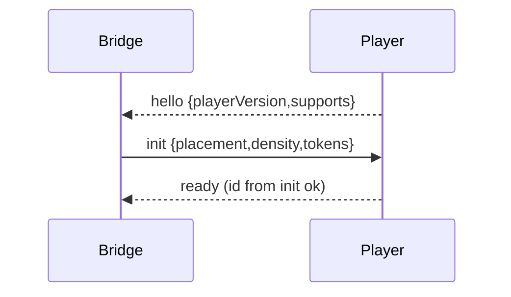
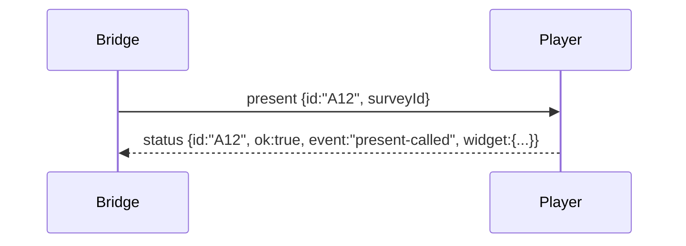
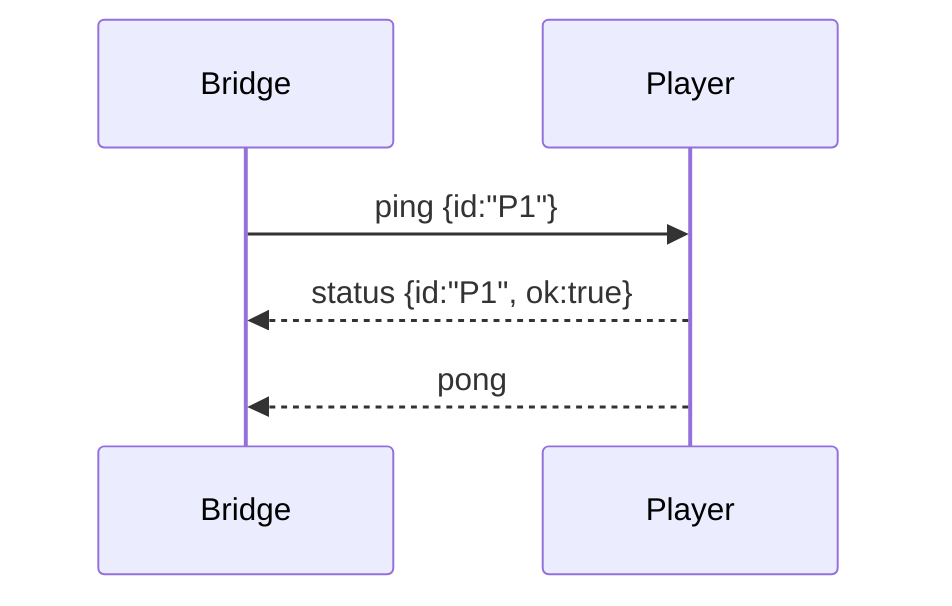

# ARCH—PROTOCOL v1 (Authoritative)
Version: **1.0.1**  
Audience: Bridge (parent window) & Player (iframe) implementers.

> A tiny, versioned message contract for Preview ↔ Player over `window.postMessage`. Every command must be **acknowledged** exactly once with the same `id`.

---

## 0) Envelope (all messages)

```jsonc
{
  "v": 1,                         // protocol version
  "id": "a7f2c1",                 // correlation id (sender creates)
  "type": "present",              // see §2
  "payload": { },                 // type-specific
  "origin": "bridge"              // optional: 'bridge' | 'player' (for logging only)
}
```

**Receiver MUST validate:**
- `event.origin` equals expected origin (see §6 Security).
- `data.v === 1`.
- `data.type` is known or safely ignored.

**Acks:** Commands are answered by exactly one message with the **same `id`** and `type: "status"` (success) or `type: "error"` (failure).

---

## 1) Roles
- **Bridge** (parent): creates Player iframe, sends commands, enforces timeouts/heartbeats, exposes events to the UI.
- **Player** (child iframe): runs Pulse Tag + theming; acks after async work is done; reports geometry.

---

## 2) Message types

### 2.1 Handshake
- `hello` **(Player → Bridge)**: `{ playerVersion: string, supports: string[] }`
- `init` **(Bridge → Player)**: `{ placement?: "BR"|"BL"|"TR"|"TL", density?: -1|0|1, tokens?: { brand?: string, radius?: number, density?: -1|0|1 } }`
- `ready` **(Player → Bridge)**: Player is initialized and able to accept commands.

### 2.2 Commands **(Bridge → Player)**
- `present`: `{ surveyId: string, force?: boolean }`
- `dismiss`: `{ }`
- `applyTheme`: `{ href?: string, css?: string, tokens?: { brand?: string, radius?: number, density?: -1|0|1 } }`
- `trigger`: `{ command: string, args?: any[] }`  // e.g. `simulateExitIntent`
- `setPlacement`: `{ placement: "BR"|"BL"|"TR"|"TL" }`
- `setTokens`: `{ brand?: string, radius?: number, density?: -1|0|1 }`
- `ping`: `{ }` // heartbeat; expect `pong`

### 2.3 Reports **(Player → Bridge)**
- `status`: `{ ok: true, event?: string, widget?: { visible: boolean, bounds?: { x:number,y:number,w:number,h:number } }, placement?: string }`
- `error`: `{ code: string, message?: string, recoverable?: boolean, hint?: string }`
- `pong`: `{ }`

> **Event field:** Optional mnemonic for tests/telemetry (e.g., `"present-called"`, `"apply-theme-applied"`).

---

## 3) Timing (default knobs)
- **Handshake timeout:** 5000 ms for `hello → ready`.
- **Ack timeout:** 3000 ms per command.
- **Heartbeat:** Bridge sends `ping` every 30000 ms; Player answers `pong`. Two consecutive misses → mark inactive (soft warning).

---

## 4) Concurrency & backpressure
- **Presentation lane**: `present`/`dismiss` are **single-flight**. A newer request cancels the previous one (`error{ code: "cancelled" }`).
- **Tuning lane**: `applyTheme` / `setTokens` / `setPlacement` run FIFO and may overlap with presentation.

---

## 5) Error taxonomy (short codes)
`boot_fail`, `player_timeout`, `not_ready`, `present_fail`, `gen_fail`, `cors_block`, `unknown_cmd`, `bad_payload`, `ack_timeout`, `implicit_ack`, `cancelled`.

---

## 6) Security (non‑negotiable)
- Set `targetOrigin` in `postMessage` to the **exact** Player origin (derived from iframe `src`). **Never `"*"`** in production.
- Reject any message whose `event.origin` isn’t the expected origin.
- Player should lock `bridgeOrigin` after the first accepted message and require it for all replies.
- Apply CSS via `<link>` or inert `<style>` only. No `eval`/Function on payloads.
- Use iframe `sandbox` attr with the minimal permissions required.

---

## 7) Geometry
Player SHOULD send `widget.visible` and `widget.bounds` in `status` whenever visibility/size changes (debounce 16–32ms). Bridge uses this to position overlays.

---

## 8) Versioning
- New fields are additive (non‑breaking). Removing fields or changing meaning is breaking → bump protocol major.
- Gate optional features with `supports` advertised in `hello`.

---

## 9) Tiny sequence diagrams

**Handshake**


**Present**


**Heartbeat**


---

## 10) Examples

**Bridge → Player (applyTheme)**
```json
{ "v":1, "id":"t9x2a", "type":"applyTheme", "payload": { "href":"/themes/indigo.css" } }
```

**Player → Bridge (status)**
```json
{ "v":1, "id":"t9x2a", "type":"status", "payload": { "ok": true, "event":"apply-theme-applied" } }
```
