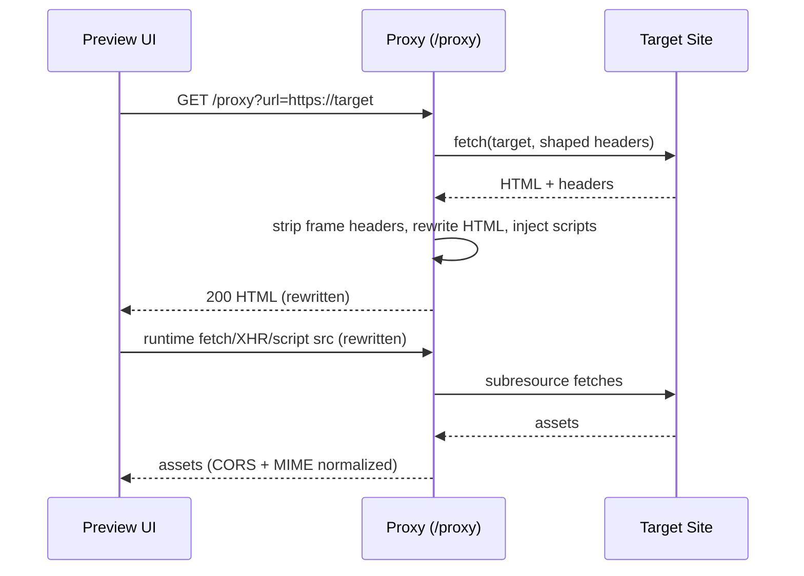

# Proxy System Overview

## Purpose
- Load arbitrary external sites inside the preview dashboard while bypassing `X-Frame-Options`/`frame-ancestors` and common consent overlays.
- Rewrite all network activity (HTML, JS, CSS, images, XHR/fetch) to traverse the proxy so cross-origin restrictions do not break previews.
- Standardize error handling for upstream failures (403s, MIME/type mismatches) to keep the preview usable.

## Key Concepts
- **Proxy origin**: The host that serves `/proxy?url=…` (Cloudflare Worker in prod, local Express in dev). Written to `window.__PI_PROXY_ORIGIN__` by the preview shell.
- **Target URL**: The remote site being previewed. Always encoded into the `url` query parameter.
- **URL rewriting**: Both server-side (HTML rewrite) and client-side (runtime interception) rewriting to force subsequent requests back through the proxy.
- **Frame unblocking**: Removal of `X-Frame-Options` and `frame-ancestors` CSP directives so the page can render in an iframe.
- **Consent suppression**: CSS/JS injection to hide common cookie/consent overlays.

## High-Level Architecture
```mermaid
flowchart TD
  A[Preview UI] -->|resolveProxyUrl()| B[Proxy origin<br>(Worker / Express)]
  B -->|validate+header shaping| C[Upstream site]
  C -->|HTML/CSS/JS/bin| B
  B -->|HTML rewrite + injections| D[Iframe in Preview]
  D -->|runtime URL interception| B
```

## Request/Response Sequence (happy path)


## Components
- **Cloudflare Worker proxy** (`functions/proxy.js`)
  - Production path: `/proxy?url=<encoded target>`.
  - Validates/allowlists targets, enforces simple in-memory rate limits, and sanitizes sensitive cookies before forwarding.
  - Builds upstream headers mirroring real browser signals (`User-Agent`, `Accept-*`, `Sec-Fetch-*`) and respects POST/PUT bodies.
  - Strips frame-blocking headers and forwards caching/CORS headers to the browser.
  - Rewrites HTML responses: injects `<base>`, rewrites URL-bearing attributes and CSS `url()`, injects consent cleanup, URL-rewriting runtime, and framework-error fallback. Adds a 403 banner when sites block embedding.
  - Detects expected MIME (via `Accept` or extension) and fixes cases where upstream returns HTML error pages for JS/CSS requests by emitting typed stubs.
  - Error path returns typed JS/CSS/JSON payloads so loaders do not crash on proxy failures.

- **Local background proxy server** (`preview/scripts/background-proxy-server.js`)
  - Node/Express implementation used in local preview (`RUN_BACKGROUND_PROXY`, `BACKGROUND_PROXY_PORT`, centralized `config/ports.js`).
  - Same `/proxy` contract and feature set as the Worker: allow/block lists, cookie sanitization, rate limiting, header normalization, MIME fixes, HTML rewriting, consent hiding, and 403 banner injection.
  - Adds body parsers for form/text/raw payloads and a persistent `__pi_proxy_target` cookie to keep target context across navigations.
  - Started automatically by `scripts/launch/services.sh`; can be disabled or re-pointed per README guidance.

- **Client helper** (`preview/app/services/proxy.js`)
  - Discovers the proxy origin (`window.__PI_PROXY_ORIGIN__` propagates through parent/opener frames) and wraps absolute URLs with `/proxy?url=…`.
  - Avoids double-proxying and leaves same-origin/local URLs untouched.
  - Used by preview UI to route background URLs and asset requests through the currently active proxy instance.

- **Integration test** (`tests/integration/preview/demo-proxy.test.mjs`)
  - Health-checks the proxy, verifies 403 banner injection, loads demo URLs from the shared sheet/fallback JSON, and asserts URL rewriting for HTML.
  - Runs standalone or via `npm test` with optional `PROXY_BASE_URL` override.

## Deep Dive: Cloudflare Worker (`functions/proxy.js`)
- **Entry**: `onRequest()` handles `OPTIONS` preflight, allowed methods, and rate limiting (`checkRateLimit` map).
- **Target validation**: `resolveTarget(raw, allowlist, blocklist)` rejects non-http(s), disallowed hosts, malformed URLs.
- **Header shaping**: `buildUpstreamHeaders()` builds realistic browser headers, sanitizes cookies via `sanitizeCookies()`, forwards `Content-Type` for POST/PUT.
- **Content routing**:
  - HTML: `ensureBaseHref()`, `rewriteResourceUrls()`, `injectFrameworkErrorHandler()`, `injectUrlRewritingScript()`, `injectConsentCleanup()`, `inject403Message()` (for status 403).
  - Non-HTML: streams `arrayBuffer`.
- **MIME fix**: Detect expected type from `Accept`/extension; if upstream returns HTML for JS/CSS, override `content-type` and emit typed stub to avoid loader crashes.
- **Error path**: Returns typed JS/CSS stubs or JSON errors with CORS; preserves `content-type` when safe.
- **Security**: Blocklist defaults to localhost/loopback; removes frame-ancestors from CSP; strips `X-Frame-Options`.

## Deep Dive: Express Proxy (`preview/scripts/background-proxy-server.js`)
- **Startup**: Port from `config/ports.js` (`BACKGROUND_PROXY_PORT`), controlled by `RUN_BACKGROUND_PROXY`.
- **Middleware**: Body parsers (json, urlencoded, text/plain, raw), cookie parser for `__pi_proxy_target`.
- **Rate limit**: `express-rate-limit` with dev localhost skip; env `PROXY_RATE_LIMIT_MAX`.
- **Route**: `/proxy` matches Worker behavior; uses `resolveTarget`, `detectExpectedContentType`, header shaping, cookie sanitization.
- **HTML pipeline**: Same injections as Worker (base tag, URL rewrite, consent hide, runtime interception, 403 banner, SSR fallback).
- **Differences**: Uses Node fetch, explicit parsers, persists target cookie to keep context across navigations.

## Endpoints and Contracts
- **HTTP route**: `GET|POST|PUT|DELETE /proxy?url=<encoded target>`
- **Preflight**: `OPTIONS /proxy?url=…` returns CORS-allowing 204 (Worker and Express).
- **CORS**: `Access-Control-Allow-Origin: *`, credentials allowed, request headers echoed.
- **Allowed schemes**: `http`, `https`; blocklist rejects localhost/loopback by default.

## Request Lifecycle
1. **Preview issues URL**: UI resolves background URL via `resolveProxyUrl()`, using `__PI_PROXY_ORIGIN__` configured in preview HTML or deployment env.
2. **Proxy validates target**: Allowlist/blocklist guard against localhost/loopback; non-http(s) protocols are rejected.
3. **Header shaping**: Proxy constructs realistic browser headers, filters sensitive cookies, and forwards POST/PUT bodies.
4. **Upstream fetch**: Follows redirects; applies rate limits and CORS.
5. **Response normalization**:
   - Removes `X-Frame-Options` and `frame-ancestors` CSP to permit iframe embedding.
   - Copies cache/CORS headers that callers may rely on.
6. **Content handling**:
   - **HTML**: Injects `<base>`, rewrites resource URLs to `/proxy?url=…`, injects runtime URL interception (fetch/XHR/script/link/img/iframe/audio/image constructors, innerHTML/outerHTML), hides consent banners, and installs a Vue/Nuxt SSR fallback plus optional 403 banner.
   - **JS/CSS**: Preserves content type; if upstream sends HTML error for a JS/CSS fetch, emits typed stub to keep loaders alive.
   - **Binary/other**: Streams bytes with passthrough headers.
7. **Browser runtime**: Injected script keeps subsequent dynamic requests proxied, even for code-split chunks, dynamic imports, or scripts created after load.

## Interaction with the Rest of the Application
- **Preview dashboard backgrounds**: When a user loads an external site as the preview background, the URL is wrapped via `resolveProxyUrl()`. The iframe then receives HTML rewritten by the proxy so all subresources route back through the proxy and remain embeddable.
- **Theme exploration & demos**: By stripping frame-blocking headers and hiding consent overlays, the preview can render target sites cleanly for screenshotting, theming, and interactive demos without CORS breakage.
- **Service launch scripts**: `scripts/launch/services.sh` starts the background proxy (port from `config/ports.js` or `BACKGROUND_PROXY_PORT`). Disabling it (`RUN_BACKGROUND_PROXY=0`) leaves local backgrounds same-origin for Stripe/demo scenarios.
- **Production deployment**: Swap `window.__PI_PROXY_ORIGIN__` in preview HTML to point at the deployed Worker (`functions/proxy.js`). The browser helper then routes all proxied URLs to that origin while keeping local assets unproxied.
- **Error visibility**: 403 banners and SSR fallback protect preview UI from blank/blocked pages; MIME-type normalization prevents module loaders from crashing when upstream sends HTML.

## Runtime URL Rewriting (browser)
- Installed into HTML responses by `injectUrlRewritingScript()` (Worker/Express).
- Guards against duplicate installs and only activates on proxied pages.
- Intercepts:
  - `fetch()` (string URL, `Request`, and objects with `url`)
  - `XMLHttpRequest.open()`
  - `HTMLScriptElement.src` / `setAttribute('src', …)` and dynamic script insertion
  - `HTMLLinkElement.href` (stylesheets), `HTMLIFrameElement.src`, `HTMLImageElement.src`, `Image()` constructor, `Audio()` constructor
  - `innerHTML` / `outerHTML` mutations containing scripts with `src`
- Resolves relative URLs against the original target origin (extracted from `proxy?url=`), not the proxy origin, then rewrites to `/proxy?url=…`.
- Uses `rewriteUrlForJs()` (browser) which mirrors server `rewriteUrl()` logic to keep parity.

## Server-Side HTML Rewriting
- Insert `<base href="<target dir>">` when missing so relative paths resolve.
- Rewrite URL-bearing attributes (`src`, `href`, `srcset`, `data-src*`, `action`, `poster`, etc.) plus CSS `url()` to `/proxy?url=…`.
- Injects:
  - **Consent hide** stylesheet/script (common selectors list)
  - **URL rewriting script** (runtime interception above)
  - **Framework error handler** (Vue/Nuxt SSR fallback to avoid blank pages)
  - **403 banner** when upstream returns 403 HTML
- See `docs/proxy/url-rewriting.md` for exhaustive attribute/API coverage.

## MIME and Error Normalization
- Expected type detection uses `Accept` header first, then extension.
- If upstream returns HTML for JS/CSS requests, proxy overrides `Content-Type` and emits typed stubs so loaders do not crash:
  - JS: `application/javascript` stub with comment and status
  - CSS: `text/css` stub with comment and status
- Non-HTML errors pass through with corrected `Content-Type`; HTML errors for HTML requests return the body intact.

## Header Strategy
- **Forwarded to upstream**: `User-Agent`, `Accept*`, `Referer`, `Origin`, `Sec-Fetch-*`, sanitized `Cookie`, and `Content-Type` for POST/PUT.
- **Returned to client**: CORS headers (`*`), cache headers passthrough (`cache-control`, `expires`, `pragma`), corrected `content-type`.
- **Removed/modified**: `X-Frame-Options`, `Content-Security-Policy` `frame-ancestors`, `Content-Security-Policy-Report-Only`.

## Client Helper Example
```js
// preview/app/services/proxy.js
export function resolveProxyUrl(target) {
  const proxyOrigin = getProxyOrigin();
  if (!proxyOrigin) return normalizeTarget(target);
  if (!/^https?:\/\//i.test(target) || isAlreadyProxied(target, proxyOrigin)) return target;
  const encoded = encodeURIComponent(normalizeTarget(target));
  return `${proxyOrigin.replace(/\/$/, '')}/proxy?url=${encoded}`;
}
```

## Environment and Configuration Matrix
- **Prod (Worker)**: `BACKGROUND_PROXY_ALLOWLIST`, `BACKGROUND_PROXY_BLOCKLIST`, `PROXY_SENSITIVE_COOKIE_PATTERNS`, `PROXY_DEBUG` (enables client logging).
- **Dev (Express)**: `BACKGROUND_PROXY_PORT`, `RUN_BACKGROUND_PROXY`, `PROXY_RATE_LIMIT_MAX`, same allow/block/cookie variables as Worker.
- **Preview HTML**: sets `window.__PI_PROXY_ORIGIN__` to the active proxy origin (local `http://localhost:3100` by default).

## Failure Modes and Mitigations
- **403 / frame-blocked**: Banner injection explains the block; CSP and `X-Frame-Options` removed when possible.
- **HTML returned for JS/CSS**: MIME override + typed stub to avoid module loader crashes.
- **Blank SPA due to hydration errors**: Framework error handler restores SSR markup and suppresses failing scripts.
- **Abuse / loops**: Rate limiting on IP; blocklist rejects loopback by default; already-proxied URLs short-circuit.
- **Consent overlays**: Style/script hides common selectors, retries for 5s to defeat delayed banners.
- **Relative path ambiguity**: `<base>` injection plus runtime resolution against target origin prevents proxy-origin leakage.

## Configuration Reference
- `BACKGROUND_PROXY_PORT`, `RUN_BACKGROUND_PROXY`: local server control (defaults: 3100, enabled).
- `BACKGROUND_PROXY_ALLOWLIST`, `BACKGROUND_PROXY_BLOCKLIST`: host gating (`*` + block localhost by default).
- `PROXY_SENSITIVE_COOKIE_PATTERNS`: comma list of cookie name fragments to strip (defaults to session/auth/token/csrf/jwt/etc.).
- `PROXY_RATE_LIMIT_MAX`: per-IP requests/minute for local proxy; Worker uses in-memory defaults (100/min).
- `__PI_PROXY_ORIGIN__`: injected in preview HTML; consumed by `getProxyOrigin()` to build proxied URLs in-browser.

## Operational Notes
- **Security**: No credentials are logged; cookies are filtered before forwarding. Blocklist protects against loopback SSRF.
- **Performance**: HTML rewriting and script injection run only for `text/html`; binary assets stream unchanged. Rate limits prevent abuse.
- **Testing**: Run `node tests/integration/preview/demo-proxy.test.mjs` (or `npm test`) with the proxy running to verify URL rewriting and 403 handling across demo targets.
